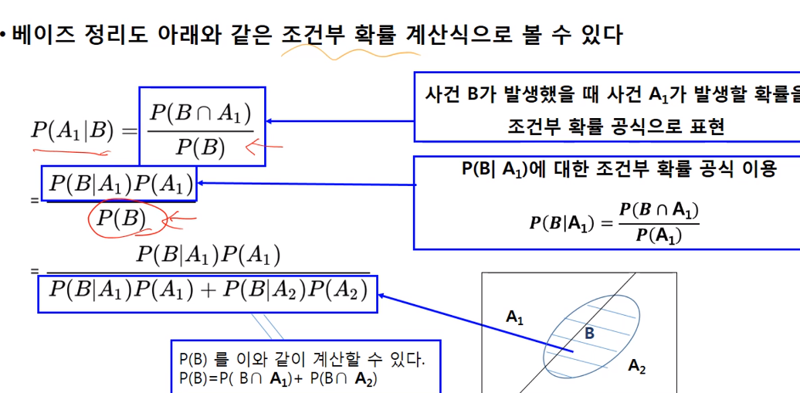

# week 4

## 4-2

조건부 확률

어떤 사건이 발생한다는 조건 하에서 다른 사건이 발생하게 될 확률

사건 B가 일어난다는 정보가 사건 A의 발생에 전혀 영향을 주지 않을 때 두 사건이 통계적 독립 이라고 한다.

단, 통계적 독립과 배반사건은 다른 개념임

### 베이즈 정리

주어진 가설에 새로운 정보가 주어졌을때 사후 확률을 계산한다.

가능도와 사전확률

주어진 사전확률과 실제 확률을 이용하여 전체 케이스가 분모

조건부 확률이 일어날 가능성이 분자가 되겠다.

ex) 

유방암 검사의 정확도는 0.9이고, 성인 여성이 유방암일 확률은 0.01이다. 유방암 검사 결과 유방암이라고 나왔을 때, 실제로 유방암에 걸렸을 확률은?

0.09x0.01/(0.9x0.01+0.1x0.09)

## 4.3 

정규분포와 포아송 분포

확률분포란

각가의 확률을 표로 나타내거나 그래프로 나타내는것

이산형과 연속형이 있음 떨어져있으면 이산형 연속적이면 연속형

기대값과 분산을 구해보자

이산형 분포에는

이항분포 다항분포 초기하분포, 포아송 분포 등이 있다.

단순히 성공, 또는 실패로 나타낼 수 있을대 (베르누이 시행)

성공이 나오는 것에 대한 분포 --->이항분포

단위 시간안에 어떤 사건이 몇번 발생하는가 ---> 포아송 분포

포아송 분포는 다양한 현실 세계의 문제와 밀접한 관련이 있다!

ex 일정 주어진 시간동안 도착한 고객의수

1km 도로에 있는 흠집의 수

와 같은 일정 간격 내에서 사건 발생의 수 

연속형 분포  확률변수가 연속형일 때 확률 분포

연속형분포에서는 정규분포가 중요하다

정규분포는 평균을 중심으로 대칭을 이루는 종모양의 연속확률분포이다.

표준정규분포는 평균이 0이고 분산이 1인 정규분포이다.

정규분포를 표준정규분포로 만드는 방법은 간단하다 -> 표준 분포 식을 찾아보자

왜표준화 하는가

표준 정규분포에서의 구간의 면적을 미리 구해두면 모든 정규분포의 면적을 바로 구할 수 있다.

-> 따로 적분 안해도 됨

연속형 분포 심화

카이제곱 분포 

F분포 - 분산 , 회귀분석에서 사용됨 

## 4.4

데이터에서 출발하는 확률과 분포

데이터 분포(특성)를 알고 있다면 데이터 분석하는 것이 쉬워짐

설명할수 없는 분포도 분명 존재 한 종류의 분포로 근사하여 설명할 수 있도록 하기 위해 **중심극한정리**를사용함

### 중심 극한 정리

이항 분포에서 표본의 수가 증가함에 따라 표본들의 전체 합이 점점 정규분포에 근접해짐

지수분포에서도 표본수의 증가에 따른 표본평균의 분포는 점점 정규분포와 비슷해짐을 볼 수 있음

원래의 분포가 정규분포가 아니더라도 표본의 수가 증가함에 따라 표본평균이 점점 정규분포 모형과 비슷해진다.

표본수 증가하면 표본평균의 분포가 정규분포에 근접

n이 30이상이면 비슷

유용한 이유 - 모집단의 분포를 몰라도 통계적검증과 추정이 가능해짐

